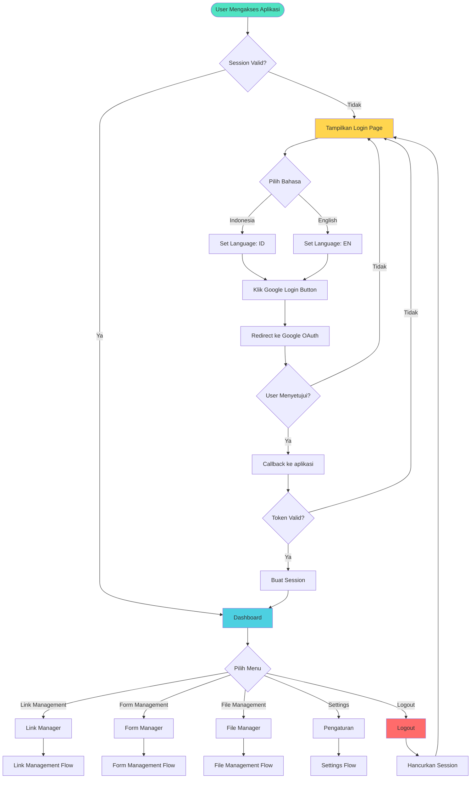
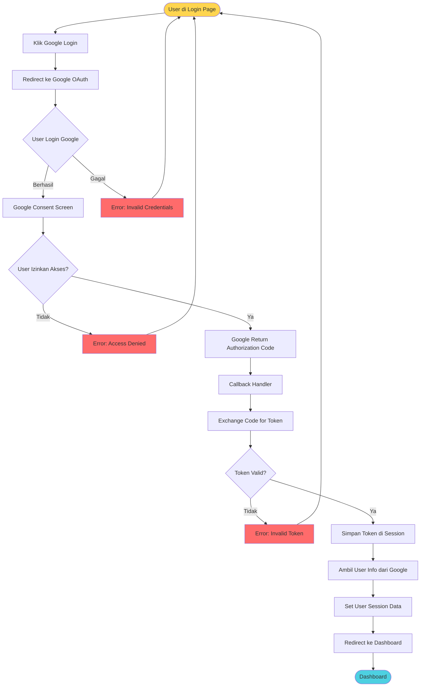
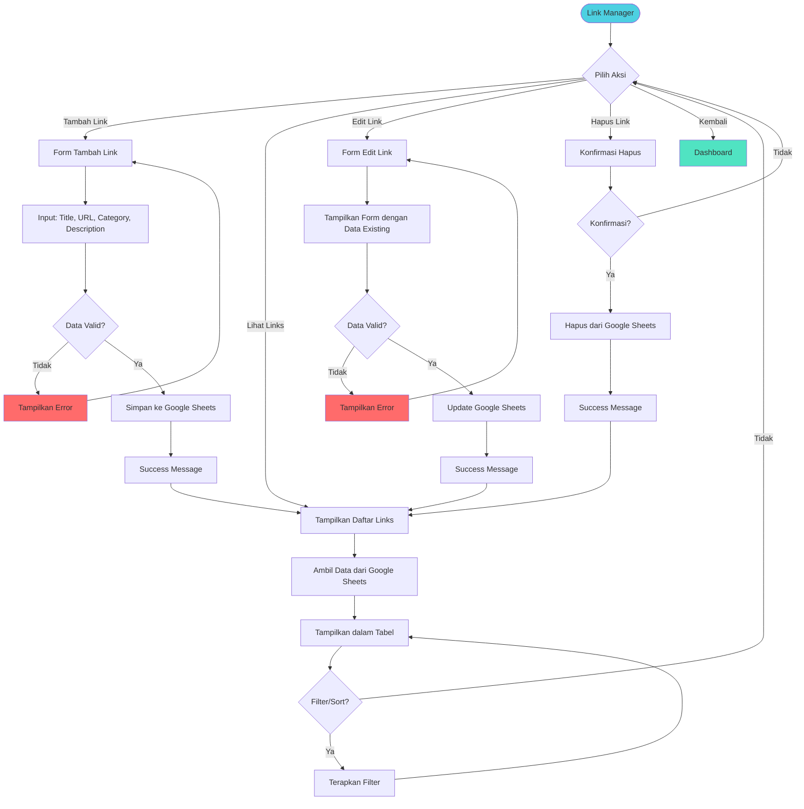
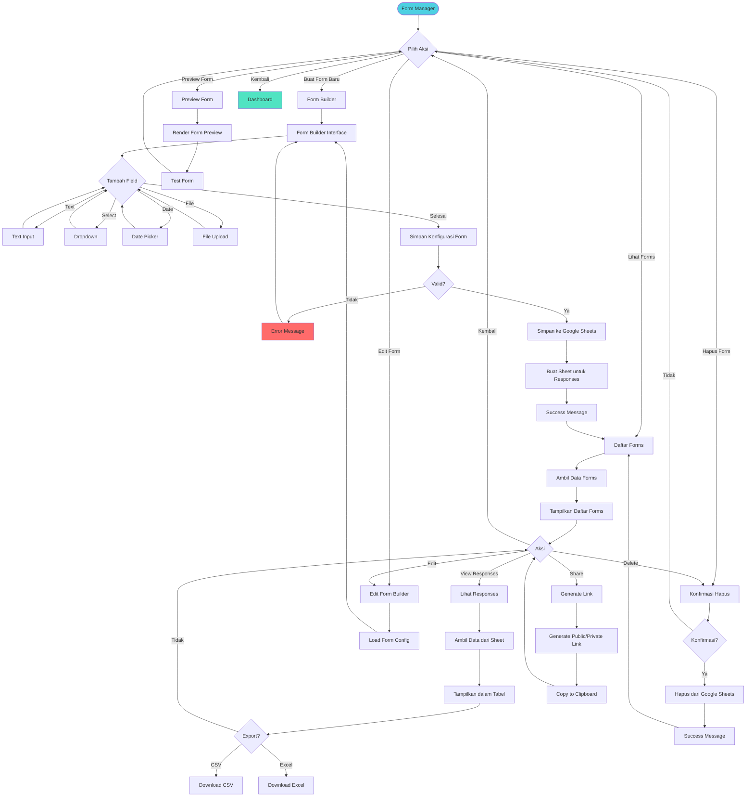
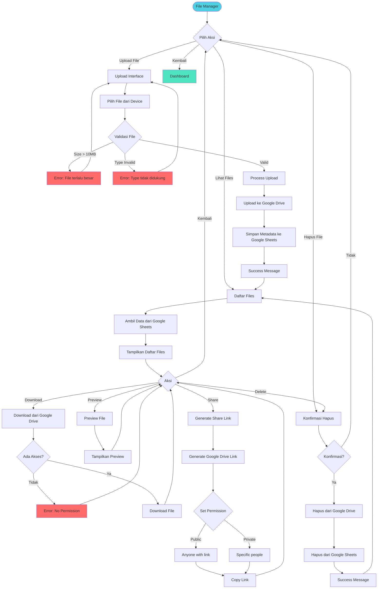
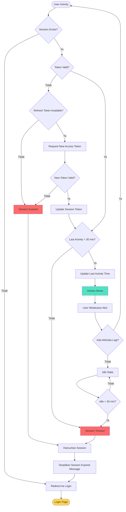
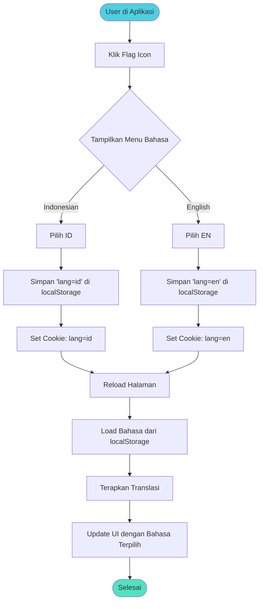
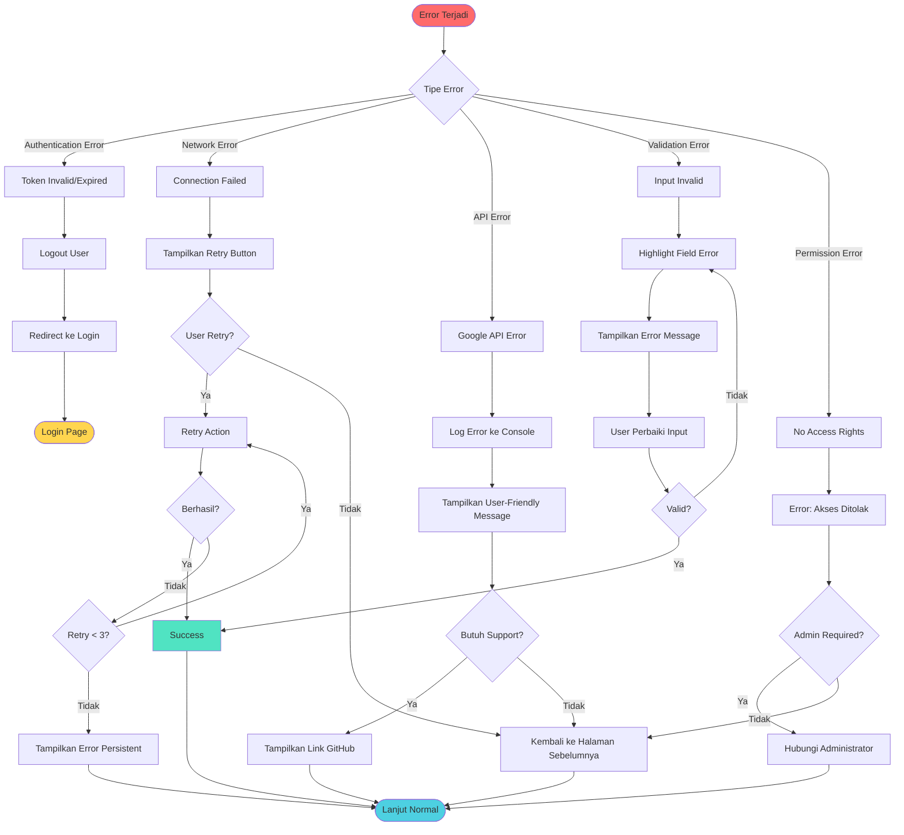
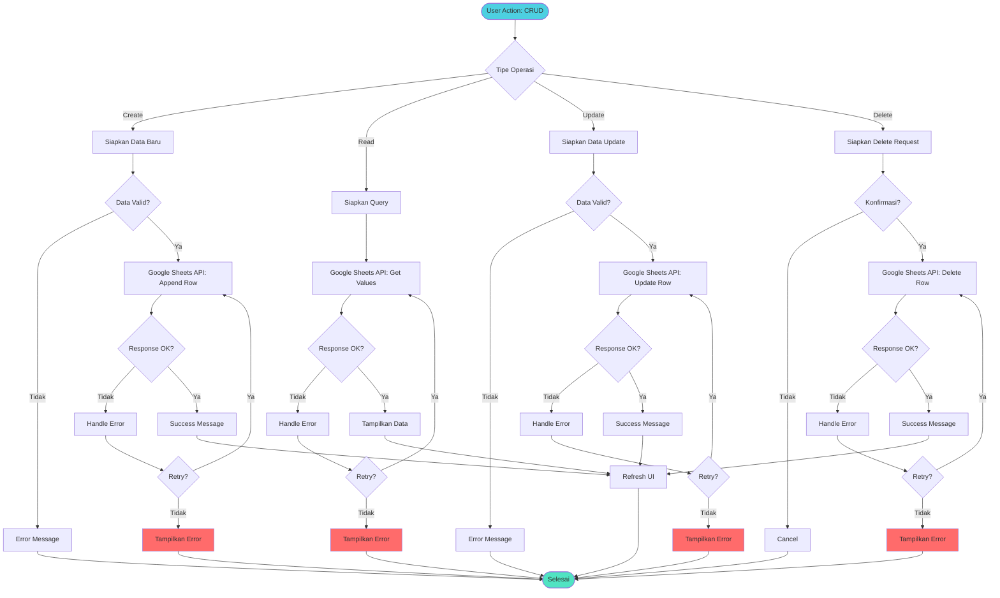
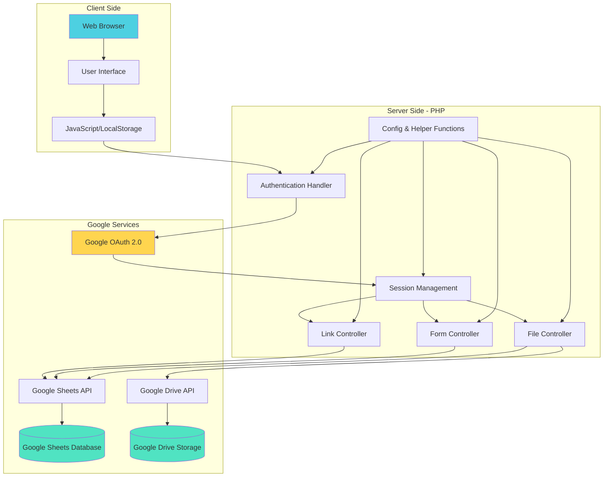

# Data Management System - Application Flowchart

## 1. Main Application Flow

## 2. Authentication Flow (Detail)

## 3. Link Management Flow

## 4. Form Management Flow

## 5. File Management Flow

## 6. Session Management Flow

## 7. Language Switching Flow

## 8. Error Handling Flow

## 9. Data Synchronization Flow

## 10. Complete System Architecture

---

## Legend (Keterangan Warna)

- 🟢 **Hijau (#50e3c2, #4dd0e1)**: Success, Active State, Main Features
- 🟡 **Kuning (#ffd54f)**: Login/Authentication, Warning
- 🔴 **Merah (#ff6b6b)**: Error, Delete Actions, Logout
- ⚪ **Default**: Normal Process Flow

---

## Catatan Penggunaan

Flowchart ini menggambarkan:
1. **Alur Utama Aplikasi** - Dari login hingga akses fitur
2. **Autentikasi** - Proses Google OAuth 2.0
3. **Manajemen Link** - CRUD operations untuk links
4. **Manajemen Form** - Form builder dan response handling
5. **Manajemen File** - Upload/download dari Google Drive
6. **Session Management** - Timeout dan refresh token
7. **Language Switching** - i18n system
8. **Error Handling** - Berbagai tipe error dan solusinya
9. **Data Sync** - Sinkronisasi dengan Google Sheets/Drive
10. **Arsitektur Sistem** - Gambaran komponen lengkap

File ini dapat dirender di GitHub, GitLab, atau editor Markdown yang mendukung Mermaid.
