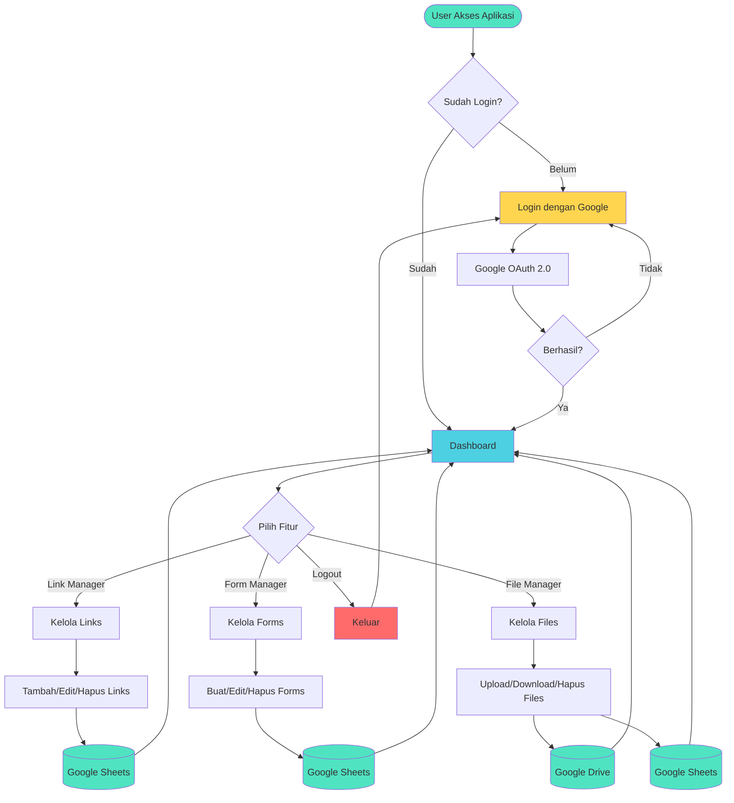
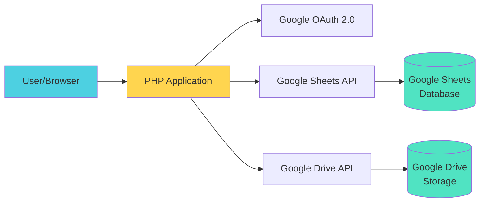

# Data Management System - Flowchart

## Alur Utama Aplikasi

## Arsitektur Sistem

---

## Keterangan

- **Login**: Autentikasi menggunakan Google OAuth 2.0
- **Dashboard**: Halaman utama setelah login berhasil
- **Link Manager**: Mengelola links (URL) di Google Sheets
- **Form Manager**: Membuat dan mengelola forms + responses
- **File Manager**: Upload/download files ke Google Drive
- **Session**: Timeout otomatis 30 menit
- **i18n**: Support 2 bahasa (Indonesia & English)

---

**Legend:**
- 🟢 Hijau: Success / Storage
- 🔵 Biru: Active Process
- 🟡 Kuning: Login/Auth
- 🔴 Merah: Logout/Exit
